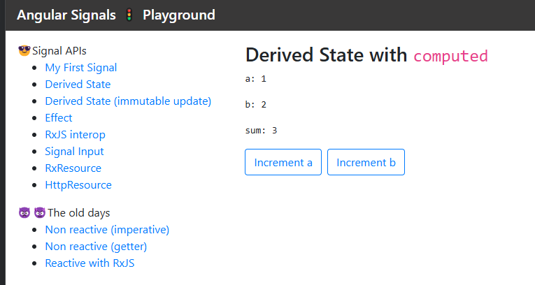

# Angular Signals Playground

In the **Angular Signals Playground** you can explore Angular [Signal](https://angular.dev/guide/signals) APIs.

### Signal APIs available in Angular 19

✅ = implemented in the playground app

*  `signal` ✅ 
*  `computed` ✅
*  `effect` ✅ (Developer preview)
*  `toSignal` ✅ (Developer preview)
*  `toObservable` ✅ (Developer preview)
*  `input` ✅
*  `model`
*  `contentChild`
*  `contentChildren`
*  `viewChild`
*  `viewChildren`

Added in Angular 19
*  `linkedSignal` (Developer preview)
*  `resource` (Experimental)
*  `rxResource` (Experimental)  ✅
*  `httpResource` (Experimental)  ✅

### Getting started

Install deps:

`npm install`

Run the playground:

`npm run start`

